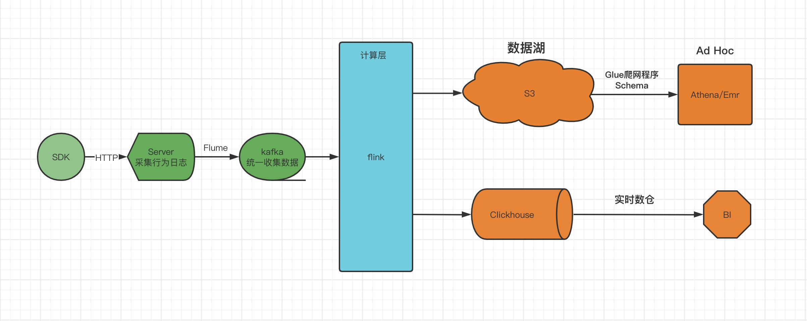

## 行为数据分析

****

### 简介

大数据处理的数据主要包括行为数据和业务数据。行为数据用来记录用户在一段时间内的行为轨迹，业务数据是指公司业务系统产生的数据，比如电商业务的下单，付费等的数据。简单总结一句就是行为数据是过程，业务数据是结果，其特点如下：
- 行为数据：数据量很大，一般为半结构话数据，表现为json或者csv，通常采用打点的方式进行采集
- 业务数据：一般由业务系统产生，结构化数据，通常以binlog的方式收集，然后同步到数据中心

由于近期工作内容涉及点击日志的处理，结合过往工作经历，以下着重对行为数据的处理进行阐述

###技术选型

- 计算引擎：采用flink实现计算上的批流一体，即能保证数据的实时性，也能节约计算资源
- 存储引擎：采用clickhouse实现存储上的批流一体，即能保证实时写入的性能，也能在olap方面有不错的表现

为了数据的安全性考虑，可以采用大数据lamda架构。如采用flink + clickhouse构建实时数仓、T+1采用aws s3构建数据湖

###系统架构

采用flink+clickhouse实现批流一体化，采用AWD S3构建数据湖，保留全部原始数据。简易架构图如下：
