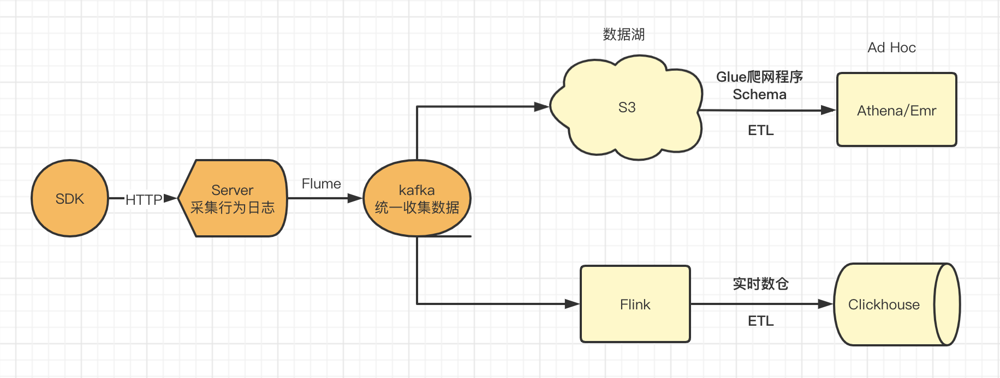

## 行为数据分析


****

### 简介

大数据处理的数据主要包括行为数据和业务数据。行为数据用来记录用户在一段时间内的行为轨迹，业务数据是指公司业务系统产生的数据，比如电商业务的下单，付费等的数据。
简单总结一句就是行为数据是过程，业务数据是结果，其特点如下：
- 行为数据：数据量很大，一般为半结构话数据，表现为json或者csv，通常采用打点的方式进行采集
- 业务数据：一般由业务系统产生，结构化数据，通常以binlog的方式收集，然后同步到数据中心

由于近期工作内容涉及点击日志的处理，结合过往工作经历，以下着重对行为数据的处理进行阐述

### 技术选型

- 计算引擎：采用flink实现计算上的批流一体，即能保证数据的实时性，也能节约计算资源
- 存储引擎：采用clickhouse实现存储上的批流一体，即能保证实时写入的性能，也能在olap方面有不错的表现

为了数据的安全性考虑，可以采用大数据lamda架构。如采用flink + clickhouse构建实时数仓、T+1采用aws s3构建数据湖

### 系统架构

采用flink+clickhouse实现批流一体化，采用AWD S3构建数据湖，保留全部原始数据。简易架构图如下：

从图中可以看到，这套架构是典型的lambda架构，离线和实时分开处理。
之所以离线模块提到数据湖的概念，是因为S3中存储了视频、图片的所有的原始数据。
从图中来能看出，离线跟实时的区别就是离线是先存储再计算，实时是先计算再存储。

_上下文准备结束，下面分享两个实用的小案_

### 日志数据解析

行为数据格式比较松散，一般需要在ods层进行规范，以下几种方法可供参考：
- 采用一小段scala代码将数据流进行处理，然后注册成临时表，供后续flink sql进行后续的计算，经测试发现该方法稳定性不高，临时表跟维度表关联之后会变成changelog stream，不推荐。
```
package com.sht.flink

import java.util.Properties
import org.apache.commons.lang3.StringUtils
import org.apache.commons.lang3.math.NumberUtils
import org.apache.flink.api.common.serialization.SimpleStringSchema
import org.apache.flink.streaming.api.scala.{StreamExecutionEnvironment, createTypeInformation}
import org.apache.flink.streaming.connectors.kafka.FlinkKafkaConsumer
import org.apache.flink.table.api.bridge.scala.StreamTableEnvironment
import org.joda.time.LocalDateTime
import java.net.URLDecoder
import java.time.Duration

object AccessLog {

  def main(args: Array[String]): Unit = {
    val properties = new Properties()
    properties.put("bootstrap.servers", "127.0.0.1:9092")
    properties.put("auto.offset.reset", "latest")
    properties.put("enable.auto.commit", "false")
    properties.put("session.timeout.ms", "120000")
    properties.put("request.timeout.ms", "180000")
    properties.put("group.id", "AccessLog")
    val senv = StreamExecutionEnvironment.createLocalEnvironment()
    val stenv = StreamTableEnvironment.create(senv)

    stenv.getConfig().setIdleStateRetention(Duration.ofHours(30))

    val kafkaConsumer = new FlinkKafkaConsumer[String]("rtdw_ods_analytics_access_log_app", new SimpleStringSchema(), properties)
    kafkaConsumer.setStartFromEarliest()

    val accessLogSourceStream = senv.addSource(kafkaConsumer).setParallelism(12)
      .name("source_kafka_rtdw_ods_analytics_access_log_app").uid("source_kafka_rtdw_ods_analytics_access_log_app")

    val accessLogRecordStream = accessLogSourceStream
      .map((message: String) => message.replace("%", "").split("\\|"))
      .filter(fields => {fields.length >= 15 && !fields(0).startsWith("127.0.0.1") && fields(1) == "analytics.youhaodongxi.com" && !(fields(5) == "HEAD / HTTP/1.0") && !(fields(5) == "GET / HTTP/1.0") && !fields(5).startsWith("OPTIONS") && StringUtils.isNotEmpty(fields(14))})
      .map(fields => {
        val timestamp = fields(4).replace(".", "")
        val ts = NumberUtils.createLong(timestamp)
        val tss = new LocalDateTime(ts).toString("yyyy-MM-dd HH:mm:ss")
        val params = fields(14).split("&")
        val map = params.map(_.split("=")).filter(_.length==2).map(arr => (arr(0), URLDecoder.decode(arr(1).replaceAll("\\\\x", "%"), "UTF-8"))).toMap
        (ts, tss
          , if (map.contains("userid")) map("userid").toLong else 0l
          , if (map.contains("eventType")) map("eventType") else ""
          , if (map.contains("fromType")) map("fromType") else ""
          , if (map.contains("columnType")) map("columnType") else ""
          , if (map.contains("grouponid")) map("grouponid").toLong else 0l
          , if (map.contains("site_id")) map("site_id").toLong else 0l
          , if (map.contains("partner_id")) map("partner_id").toLong else 0l
          , if (map.contains("categorySec_id")) map("categorySec_id").toLong else 0l
          , if (map.contains("merchandiseId")) map("merchandiseId").toLong else 0l
          , if (map.contains("share_userid")) map("share_userid").toLong else 0l
          , if (map.contains("orderid")) map("orderid").toLong else 0l
          , if (map.contains("activeid")) map("activeid").toLong else 0l
          , if (map.contains("point_index")) map("point_index").toLong else 0l
          , if (map.contains("flashkilltabid")) map("flashkilltabid").toLong else 0l
          , if (map.contains("live_id")) map("live_id").toLong else 0l
          , if (map.contains("kingkong_id")) map("kingkong_id").toLong else 0l
          , if (map.contains("lat")) map("lat").toDouble else 0
          , if (map.contains("lon")) map("lon").toDouble else 0)
      })
      .name("filter_access_log_reqs").uid("filter_access_log_reqs")

    stenv.createTemporaryView("ods_kafka_analytics_access_log_taobao", stenv.fromDataStream(accessLogRecordStream)
      .as("ts", "tss", "userId", "eventType", "fromType", "columnType", "grouponId", "siteId", "partnerId", "categoryId"
        , "merchandiseId", "shareUserId", "orderId", "activeId", "pointIndex", "flashKillTabId", "liveId", "kingkongId", "latitude", "longitude"))

    stenv.executeSql("" +
      "CREATE TABLE dwd_kafka_analytics_access_log_taobao ( " +
      "  siteId BIGINT, " +
      "  userId BIGINT" +
      ") WITH ( " +
      "  'connector' = 'kafka', " +
      "  'topic' = 'rtdw_dwd_analytics_access_log_taobao', " +
      "  'properties.bootstrap.servers' = '127.0.0.1:9092', " +
      "  'properties.enable.auto.commit' = 'false', " +
      "  'properties.session.timeout.ms' = '90000', " +
      "  'properties.request.timeout.ms' = '325000', " +
      "  'format' = 'json', " +
      "  'json.fail-on-missing-field' = 'false', " +
      "  'json.ignore-parse-errors' = 'true', " +
      "  'sink.partitioner' = 'round-robin', " +
      "  'sink.parallelism' = '4' " +
      ") " +
      "")

    stenv.executeSql("insert into dwd_kafka_analytics_access_log_taobao(userId, siteId) select userId, siteId from ods_kafka_analytics_access_log_taobao")
  }
}
```
- 直接采用datastream对数据进行清洗，清洗完之后会写kafka形成dwd层数据，该方法运行稳定，将数据清洗和后续的补维打宽做了解耦，但是数据有冗余，行为数据量级较大，不推荐。
- 采用csv format + mpa udf方式，csv format解析外层access log格式的日志，参数自定义udf转成map。其实也可以修改csv format让其支持map数据结构，但是源码是采用jackson实现的，jackson本身就没有map类型，所以源码修改比较困难，自定义udf实现最为合理。
```
package com.sht.flink

import com.sht.flink.udf.SplitQueryParamsAsMap
import org.apache.flink.streaming.api.scala.StreamExecutionEnvironment
import org.apache.flink.table.api.bridge.scala.StreamTableEnvironment

object CsvFormatTest {

  def main(args: Array[String]): Unit = {
    val env = StreamExecutionEnvironment.getExecutionEnvironment
    val tableEnvironment = StreamTableEnvironment.create(env)

    // 注册函数
    tableEnvironment.createTemporarySystemFunction("SplitQueryParamsAsMap", classOf[SplitQueryParamsAsMap])

    // access flink configuration// access flink configuration
    val configuration = tableEnvironment.getConfig.getConfiguration
    // set low-level key-value options
    configuration.setString("table.dynamic-table-options.enabled", "true")

    tableEnvironment.executeSql("" +
      "CREATE TABLE kafka_analytics_access_log ( " +
      "  remote_addr STRING, " +
      "  host STRING, " +
      "  request_time STRING, " +
      "  time_local STRING, " +
      "  msec STRING, " +
      "  request STRING, " +
      "  status STRING, " +
      "  body_bytes_sent STRING, " +
      "  http_referer STRING, " +
      "  http_cookie STRING, " +
      "  http_user_agent STRING, " +
      "  http_x_forwarded_for STRING, " +
      "  upstream_addr STRING, " +
      "  request_length STRING, " +
      "  query_string STRING, " +
      "  procTime AS PROCTIME() " +
      ") WITH ( " +
      "  'connector' = 'kafka', " +
      "  'topic' = 'rtdw_ods_analytics_access_log_app', " +
      "  'properties.bootstrap.servers' = '127.0.0.1:9092', " +
      "  'properties.enable.auto.commit' = 'false', " +
      "  'properties.session.timeout.ms' = '90000', " +
      "  'properties.request.timeout.ms' = '325000', " +
      "  'format' = 'csv', " +
      "  'csv.field-delimiter' = '|', " +
      "  'csv.ignore-parse-errors' = 'true' " +
      ") " +
      "")

    tableEnvironment.executeSql("" +
      "SELECT " +
      "    ts, " +
      "    FROM_UNIXTIME(ts / 1000) AS tss, " +
      "    SUBSTR(FROM_UNIXTIME(ts / 1000), 0, 10) AS tssDay, " +
      "    CAST(COALESCE(mp['userid'], '-1') AS BIGINT) AS userId, " +
      "    COALESCE(mp['eventType'], '') AS eventType, " +
      "    COALESCE(mp['fromType'], '') AS fromType, " +
      "    COALESCE(mp['columnType'], '') AS columnType, " +
      "    CAST(COALESCE(mp['site_id'], '-1') AS BIGINT) AS siteId, " +
      "    CAST(COALESCE(mp['grouponid'], '-1') AS BIGINT) AS grouponId, " +
      "    CAST(COALESCE(mp['partner_id'], '-1') AS BIGINT) AS partnerId, " +
      "    CAST(COALESCE(mp['categoryid'], '-1') AS BIGINT) AS categoryId, " +
      "    CAST(COALESCE(mp['categorySec_id'], '-1') AS BIGINT) AS secCategoryId, " +
      "    CAST(COALESCE(mp['merchandiseid'], '-1') AS BIGINT) AS merchandiseId, " +
      "    CAST(COALESCE(mp['share_userid'], '-1') AS BIGINT) AS shareUserId, " +
      "    CAST(COALESCE(mp['activeid'], '-1') AS BIGINT) AS activeId, " +
      "    CAST(COALESCE(mp['point_index'], '-1') AS BIGINT) AS pointIndex, " +
      "    CAST(COALESCE(mp['kingkong_id'], '-1') AS BIGINT) AS kingkongId, " +
      "    CAST(COALESCE(mp['flashkilltabid'], '-1') AS BIGINT) AS flashKillTabId, " +
      "    CAST(COALESCE(mp['live_id'], '-1') AS BIGINT) AS liveId, " +
      "    CAST(COALESCE(mp['orderid'], '-1') AS BIGINT) AS orderId, " +
      "    CAST(COALESCE(mp['lat'], '-1.0') AS DOUBLE) AS latitude, " +
      "    CAST(COALESCE(mp['lon'], '-1.0') AS DOUBLE) AS longitude, " +
      "    COALESCE(mp['couponid'], '') AS couponId, " +
      "    COALESCE(mp['searchTag'], '') AS searchTag, " +
      "    COALESCE(mp['to_areaname'], '') AS areaName, " +
      "    procTime " +
      "    FROM ( " +
      "    SELECT  " +
      "        CAST(REPLACE(msec, '.', '') AS BIGINT) AS ts,  " +
      "        SplitQueryParamsAsMap(REPLACE(query_string, '%', '')) AS mp, " +
      "        procTime " +
      "    FROM kafka_analytics_access_log /*+ OPTIONS('scan.startup.mode'='earliest-offset') */ " +
      "    WHERE CHAR_LENGTH(query_string) > 1 " +
      ") t " +
      "").print()
  }
}
```

### 自定义Table Format

- 由于近期工作内容与table format紧密相关。比如flink cdc，其核心还是采用canal-json解析binglog日志。
查看源码得知canal-json、csv、json format 都是基于jackson进行序列化和反序列化的。
  
- event-json作为一个自定义的table format，主要用于对事件这类数据结构不齐的json数据进行操作。它将公共字段在ddl中定义，其他字段以json的形式存在metadata中的other中获取，案例如下：

样例数据
```
{"uid":"100", "key":"login", "ip":"127.0.0.1"}
{"uid":"100", "key":"register", "phone":"123456", "nickname":"david"}
{"uid":"100", "key":"addItem", "id":"2", "num":3}
```
使用demo
```
import org.apache.flink.streaming.api.environment.StreamExecutionEnvironment;
import org.apache.flink.table.api.bridge.java.StreamTableEnvironment;

public class EventJsonFormatTest {
    public static void main(String[] args) {
        StreamExecutionEnvironment env = StreamExecutionEnvironment.getExecutionEnvironment();
        StreamTableEnvironment tableEnvironment = StreamTableEnvironment.create(env);

        tableEnvironment.executeSql(" " +
            " CREATE TABLE sourceTable ( " +
            "  others STRING METADATA FROM 'value.others', " +
            "  key STRING, " +
            "  uid STRING " +
            " ) WITH ( " +
            "  'connector' = 'kafka', " +
            "  'topic' = 'event', " +
            "  'properties.bootstrap.servers' = '127.0.0.1:9092', " +
            "  'properties.enable.auto.commit' = 'false', " +
            "  'properties.session.timeout.ms' = '90000', " +
            "  'properties.request.timeout.ms' = '325000', " +
            "  'scan.startup.mode' = 'earliest-offset' , " +
            "  'value.format' = 'event-json', " +
            "  'value.event-json.others' = 'others' " +
            " ) "
        );

        tableEnvironment.executeSql(" " +
            " CREATE TABLE sinkTable ( " +
            "  others STRING, " +
            "  key STRING, " +
            "  uid STRING " +
            " ) WITH ( " +
            "  'connector' = 'kafka', " +
            "  'topic' = 'dwd_event', " +
            "  'properties.bootstrap.servers' = '127.0.0.1:9092', " +
            "  'properties.enable.auto.commit' = 'false', " +
            "  'properties.session.timeout.ms' = '90000', " +
            "  'properties.request.timeout.ms' = '325000', " +
            "  'value.format' = 'event-json', " +
            "  'value.event-json.others' = 'others', " +
            "  'sink.partitioner' = 'round-robin', " +
            "  'sink.parallelism' = '4' " +
            " ) "
        );

//        tableEnvironment.executeSql("select * from sourceTable");

        tableEnvironment.executeSql("insert into sinkTable(key, uid, others) select key, uid, others from sourceTable");
    }
}
```
输出结果
```
+----+--------------------------------+--------------------------------+--------------------------------+
| op |                         others |                            key |                            uid |
+----+--------------------------------+--------------------------------+--------------------------------+
| +I |             {"ip":"127.0.0.1"} |                          login |                            100 |
| +I | {"phone":"123456","nickname... |                       register |                            100 |
| +I |             {"num":3,"id":"2"} |                        addItem |                            100 |
```

### 讨论

行为数据存储问题。由于事件携带的字段是可扩展的，所以结构定义不好做，以下有几种方案：
1. key-value存储。将一条事件的多个字段以多行的形式进行存储，类似于列转行。
2. 采用clickhouse列式存储，动态添加列。
3. 采用clickhouse的map数据类型存储事件的扩展字段。
4. 公共字段定义单独的列，扩展字段用json字符串的方式存储。查询用json函数去访问。

大家可以谈谈自己的意见。