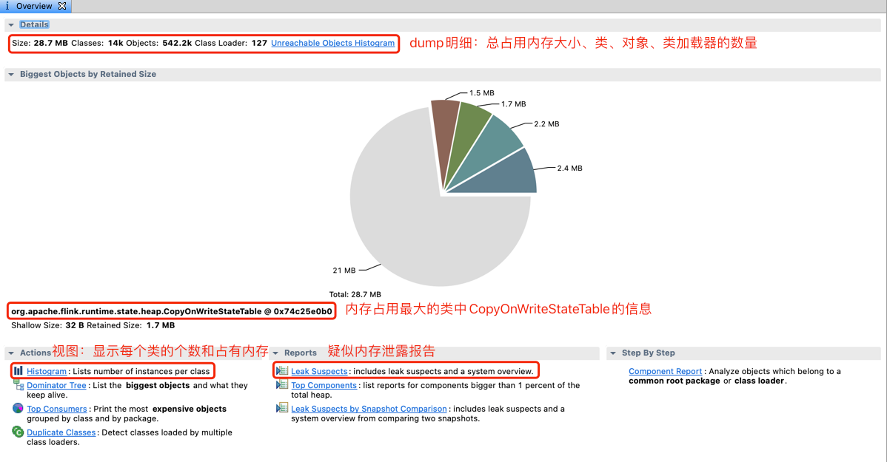
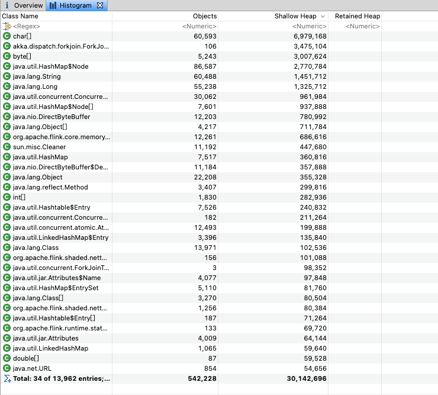
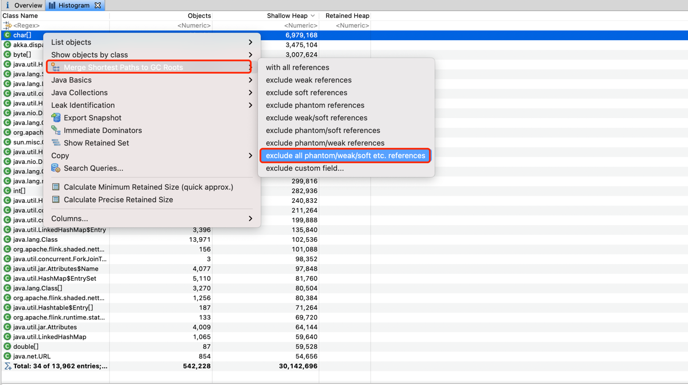
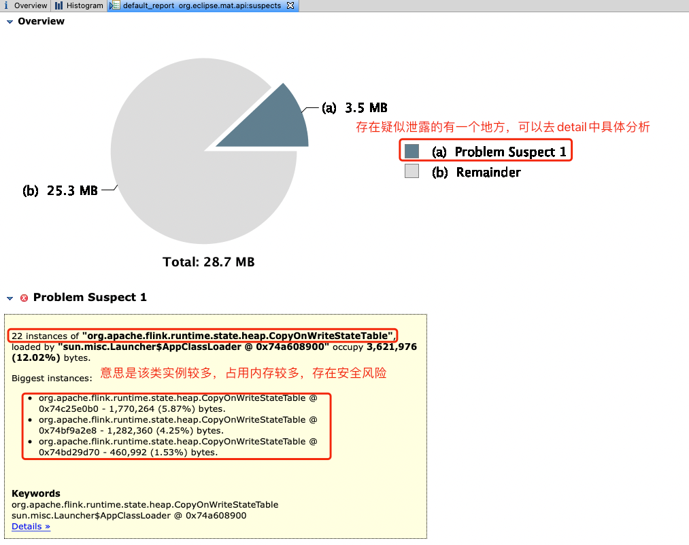

## JVM常用调试工具介绍

一、Linux ps （英文全拼：process status）命令用于显示当前进程的状态
```
ps -e : 所有的进程均显示出来
ps -f : 显示详细信息
ps aux : 查看进程占用内存和cpu
ps -ef | grep java : 查询Java进程的详细信息，一般用来查询Java进程的进程号
ps aux --sort -rss : 列出进程拿物理内存占用排序，一般用来查询哪个进程占有资源最多
ps aux --sort=-rss : 同上，按内存降序排列
ps aux --sort=+rss : 按内存升序排列
ps aux --sort=-%cpu : 为按cpu降序排列
ps aux --sort=+%cpu : 按cpu升序排列
```
ps aux 基本输出
```
USER       PID %CPU %MEM    VSZ   RSS TTY      STAT START   TIME COMMAND
root     27487  0.1  0.1 1177836 109764 ?      SNl  03:20   0:46 /usr/bin/osqueryd
root      1459  0.0  0.1 191196 103600 ?       Ss   Jul28   1:24 /usr/lib/systemd/systemd-journald
root      3081  0.0  0.1 545396 66376 ?        Ssl  Jul28   1:59 /usr/sbin/rsyslogd -n
```
ps aux 列名解释
```
USER //用户名
%CPU //进程占用的CPU百分比
%MEM //占用内存的百分比
VSZ //该进程使用的虚拟內存量（KB）
RSS //该进程占用的固定內存量（KB）（驻留中页的数量）
STAT //进程的状态
START //该进程被触发启动时间
TIME //该进程实际使用CPU运行的时间
```
*注：优化机器资源主要从占用机器cpu和mem高的程序入手*

二、Linux top命令查看正在运行的进程和系统负载信息，包括cpu负载、内存使用、各个进程所占系统资源等
```
d 指定每两次屏幕信息刷新之间的时间间隔。当然用户可以使用s交互命令来改变之。
p 通过指定监控进程ID来仅仅监控某个进程的状态
s 使top命令在安全模式中运行。这将去除交互命令所带来的潜在危险。
i 使top不显示任何闲置或者僵死进程。
c 显示整个命令行而不只是显示命令名。
-n 与 -b 搭配，意义是，需要进行几次 top 的输出结果。
-p 指定某些个 PID 来进行观察监测而已

top -d 2 : 每两秒执行一次top的刷新
top -n 2 : 刷新2次后退出执行
```
基本输出
```
top - 15:17:12 up 48 days,  4:37,  1 user,  load average: 0.06, 0.05, 0.05
Tasks: 216 total,   1 running, 215 sleeping,   0 stopped,   0 zombie
%Cpu(s):  0.2 us,  0.1 sy,  0.0 ni, 99.7 id,  0.0 wa,  0.0 hi,  0.0 si,  0.0 st
KiB Mem : 64756908 total, 35147892 free,  6943464 used, 22665552 buff/cache
KiB Swap:        0 total,        0 free,        0 used. 53694472 avail Mem 

  PID USER      PR  NI    VIRT    RES    SHR S  %CPU %MEM     TIME+ COMMAND                                                                                 
 2967 root      20   0  721404  21428   6684 S   1.7  0.0 525:13.46 node_exporter                                                                           
27058 yarn      20   0 3106652 690164  30056 S   1.3  1.1 863:58.17 java                                                                                    
 3171 root      20   0 1013820  17204   5796 S   0.7  0.0 180:00.47 /usr/local/clou                                                                         
22513 root      10 -10  147488  31112   9948 S   0.7  0.0 352:29.84 AliYunDun                                                                               
31528 root      20   0 1258444  49784   7960 S   0.7  0.1 368:42.25 python2                                                                                 
 3052 zookeep+  20   0 6466816 564708  14604 S   0.3  0.9  38:39.92 java                                                                                    
 4631 yarn      20   0 3740852   1.0g 107820 S   0.3  1.6  80:26.75 java                                                                                    
 5571 yarn      20   0 2843540 917988  41528 S   0.3  1.4 108:07.28 java                                                                                    
10534 root      20   0  154672   5548   4240 S   0.3  0.0   0:00.06 sshd                                                                                    
13723 yarn      20   0 3116408 978.1m  41568 S   0.3  1.5 117:49.00 java                                                                                    
23847 root      20   0  162168   2392   1580 R   0.3  0.0   0:00.01 top
```
字段解释
```
上半部分显示了整体系统负载情况:
top一行：从左到右依次为当前系统时间，系统运行的时间，系统在之前1min、5min和15min内cpu的平均负载值
Tasks一行：该行给出进程整体的统计信息，包括统计周期内进程总数、运行状态进程数、休眠状态进程数、停止状态进程数和僵死状态进程数
Cpu(s)一行：cpu整体统计信息，包括用户态下进程、系统态下进程占用cpu时间比，nice值大于0的进程在用户态下占用cpu时间比，cpu处于idle状态、wait状态的时间比，以及处理硬中断、软中断的时间比
Mem一行：该行提供了内存统计信息，包括物理内存总量、已用内存、空闲内存以及用作缓冲区的内存量
Swap一行：虚存统计信息，包括交换空间总量、已用交换区大小、空闲交换区大小以及用作缓存的交换空间大小

下半部分显示了各个进程的运行情况
PID: 进程pid
USER: 拉起进程的用户
PR: 该列值加100为进程优先级，若优先级小于100，则该进程为实时(real-time)进程，否则为普通(normal)进程，实时进程的优先级更高，更容易获得cpu调度，以上输出结果中，java进程优先级为120，是普通进程，had进程优先级为2，为实时进程，migration 进程的优先级RT对应于0，为最高优先级
NI: 进程的nice优先级值，该列中，实时进程的nice值为0，普通进程的nice值范围为-20~19
VIRT: 进程所占虚拟内存大小（默认单位kB）
RES: 进程所占物理内存大小（默认单位kB）
SHR: 进程所占共享内存大小（默认单位kB）
S: 进程的运行状态
%CPU: 采样周期内进程所占cpu百分比
%MEM: 采样周期内进程所占内存百分比
TIME+: 进程使用的cpu时间总计
COMMAND: 拉起进程的命令
```

三、Linux top -H -p pid。查看某个进程内部线程占用情况
```
top -H -p 4631

  PID USER      PR  NI    VIRT    RES    SHR S %CPU %MEM     TIME+ COMMAND                                                                                  
 4631 yarn      20   0 3740852   1.0g 107820 S  0.0  1.6   0:00.00 java                                                                                     
 4781 yarn      20   0 3740852   1.0g 107820 S  0.0  1.6   0:00.58 java                                                                                     
 4782 yarn      20   0 3740852   1.0g 107820 S  0.0  1.6   0:17.15 java                                                                                     
 4783 yarn      20   0 3740852   1.0g 107820 S  0.0  1.6   0:17.17 java                                                                                     
 4784 yarn      20   0 3740852   1.0g 107820 S  0.0  1.6   0:17.20 java                                                                                     
 4785 yarn      20   0 3740852   1.0g 107820 S  0.0  1.6   0:17.14 java                                                                                     
 4786 yarn      20   0 3740852   1.0g 107820 S  0.0  1.6   0:17.14 java                                                                                     
 4787 yarn      20   0 3740852   1.0g 107820 S  0.0  1.6   0:17.17 java 
```

四、jps(Java Virtual Machine Process Status Tool) 是java提供的一个显示当前所有java进程pid的命令
```
jps -m	启动时main()的参数
jps -l	输出主类全名
jps -v	输出虚拟机进程启动时的参数
```

五、jinfo LVMID，打印配置信息

六、jstat(Java Virtual Machine statistics monitoring tool)主要利用JVM内建的指令对Java应用程序的资源和性能进行实时的命令行的监控，包括了对Heap size和垃圾回收状况的监控。可见，Jstat是轻量级的、专门针对JVM的工具，非常适用
0. jstat -options
```
jstat -class (类加载器) 
jstat -compiler (JIT) 
jstat -gc (GC堆状态) 
jstat -gccapacity (各区大小) 
jstat -gccause (最近一次GC统计和原因) 
jstat -gcnew (新区统计)
jstat -gcnewcapacity (新区大小)
jstat -gcold (老区统计)
jstat -gcoldcapacity (老区大小)
jstat -gcpermcapacity (永久区大小)
jstat -gcutil (GC统计汇总)
jstat -printcompilation (HotSpot编译统计)
```
1. jstat –class<pid> : 显示加载class的数量，及所占空间等信息
```
jstat -class 27058 1000 5 : 一秒执行一次，执行5次之后退出

Loaded  Bytes  Unloaded  Bytes     Time   
  8991 17923.7       35    50.3       2.83
  8991 17923.7       35    50.3       2.83
  8991 17923.7       35    50.3       2.83
  8991 17923.7       35    50.3       2.83
  8991 17923.7       35    50.3       2.83
  
Loaded - 装载的类的数量
Bytes - 装载类所占用的字节数
Unloaded - 卸载类的数量
Bytes - 卸载类的字节数
Time - 装载和卸载类所花费的时间
```
2. jstat -gc <pid>: 可以显示gc的信息，查看gc的次数，及时间
```
jstat -gc 27058 1000 5 : 一秒执行一次，执行5次之后退出

 S0C    S1C    S0U    S1U      EC       EU        OC         OU       MC     MU    CCSC   CCSU   YGC     YGCT    FGC    FGCT     GCT   
34944.0 34944.0 2187.1  0.0   279616.0 156340.1  699072.0   56809.5   57908.0 56899.0 6520.0 6243.6  97000  903.441   4      0.034  903.475
34944.0 34944.0 2187.1  0.0   279616.0 156842.5  699072.0   56809.5   57908.0 56899.0 6520.0 6243.6  97000  903.441   4      0.034  903.475
34944.0 34944.0 2187.1  0.0   279616.0 157202.9  699072.0   56809.5   57908.0 56899.0 6520.0 6243.6  97000  903.441   4      0.034  903.475
34944.0 34944.0 2187.1  0.0   279616.0 189623.8  699072.0   56809.5   57908.0 56899.0 6520.0 6243.6  97000  903.441   4      0.034  903.475
34944.0 34944.0 2187.1  0.0   279616.0 190124.3  699072.0   56809.5   57908.0 56899.0 6520.0 6243.6  97000  903.441   4      0.034  903.475

S0C - 年轻代中第一个survivor（幸存区）的容量 (字节)
S1C - 年轻代中第二个survivor（幸存区）的容量 (字节)
S0U - 年轻代中第一个survivor（幸存区）目前已使用空间 (字节)
S1U - 年轻代中第二个survivor（幸存区）目前已使用空间 (字节)
EC  - 年轻代中Eden（伊甸园）的容量 (字节)
EU  - 年轻代中Eden（伊甸园）目前已使用空间 (字节)
OC  - Old代的容量 (字节)
OU  - Old代目前已使用空间 (字节)
PC  - Perm(持久代)的容量 (字节)
PU  - Perm(持久代)目前已使用空间 (字节)
YGC - 从应用程序启动到采样时年轻代中gc次数
YGCT- 从应用程序启动到采样时年轻代中gc所用时间(s)
FGC - 从应用程序启动到采样时old代(全gc)gc次数
FGCT- 从应用程序启动到采样时old代(全gc)gc所用时间(s)
GCT - 从应用程序启动到采样时gc用的总时间(s)
```

七、jstack（Java Stack Trace Tool）主要用于生成java虚拟机当前时刻的线程快照。线程快照是当前java虚拟机内每一条线程正在执行的方法堆栈的集合，生成线程快照的主要目的是定位线程出现长时间停顿的原因，如线程间死锁、死循环、请求外部资源导致的长时间等待等。 线程出现停顿的时候通过jstack来查看各个线程的调用堆栈，就可以知道没有响应的线程到底在后台做什么事情，或者等待什么资源
0. jstat -options
```
jstack -F LVMID		打印线程信息
jstack -l LVMID		除了堆栈外，显示关于锁的附加信息
jstack -m LVMID		如果调用本地方法的话，可以显示C/C++的堆栈
```
1. 利用jstack查看死锁情况
```
jstack -l 33818

...
"VM Periodic Task Thread" os_prio=31 tid=0x00007ffaa7827800 nid=0xa703 waiting on condition 

JNI global references: 15


Found one Java-level deadlock:
=============================
"Thread-1":
  waiting to lock monitor 0x00007ffaa7810a18 (object 0x000000066ac1e698, a java.lang.Object),
  which is held by "Thread-0"
"Thread-0":
  waiting to lock monitor 0x00007ffaa7813358 (object 0x000000066ac1e6a8, a java.lang.Object),
  which is held by "Thread-1"

Java stack information for the threads listed above:
===================================================
"Thread-1":
	at com.sample.jvmdebug.DeadLock.run(DeadLock.java:31)
	- waiting to lock <0x000000066ac1e698> (a java.lang.Object)
	- locked <0x000000066ac1e6a8> (a java.lang.Object)
	at java.lang.Thread.run(Thread.java:748)
"Thread-0":
	at com.sample.jvmdebug.DeadLock.run(DeadLock.java:19)
	- waiting to lock <0x000000066ac1e6a8> (a java.lang.Object)
	- locked <0x000000066ac1e698> (a java.lang.Object)
	at java.lang.Thread.run(Thread.java:748)
...
```
2. 利用jstack查看负载高的线程堆栈  
```
a. 查看应用进程中负载高的线程

top -H -p 31424
                                                                                      
9819  yarn      20   0 3801676   2.0g  48512 S  0.7  1.6   8:34.24 java                                                                                           
31521 yarn      20   0 3801676   2.0g  48512 S  0.3  1.6   0:45.64 java                                                                                           
31534 yarn      20   0 3801676   2.0g  48512 S  0.3  1.6   8:30.38 java                                                                                           
31555 yarn      20   0 3801676   2.0g  48512 S  0.3  1.6   0:12.13 java                                                                                           
12683 yarn      20   0 3801676   2.0g  48512 S  0.3  1.6   0:32.69 java                                                                                           
31424 yarn      20   0 3801676   2.0g  48512 S  0.0  1.6   0:00.00 java

b. 将10近制线程ID转换成16近制

printf  "%x\n" 9819

265b

sudo -u yarn /usr/java/jdk1.8.0_181-cloudera/bin/jstack 9794 | grep 265b
"G1 Concurrent Refinement Thread#23" os_prio=0 tid=0x00007f38d005c800 nid=0x265b runnable 

由以上步骤可定位到占用资源最高的线程栈，也就定位了具体那段代码出现问题了。上面示例查出来占用较多的是在GC这块，可通过调试GC参数来解决。
```
八、jmap命令(Java Memory Map)是其中之一。主要用于打印指定Java进程(或核心文件、远程调试服务器)的共享对象内存映射或堆内存细节  
0. jstat -options
```
jmap -heap          打印jvm heap的情况  
jmap -histo         打印jvm heap的直方图。其输出信息包括类名，对象数量，对象占用大小。  
jmap -histo:live    同上，但是只答应存活对象的情况  
jmap -permstat      打印permanent generation heap情况  
jmap -dump:live,format=b,file=heap.hprof    使用hprof二进制形式,输出jvm的heap内容到文件
```
1. 查看堆信息
```
jmap -heap 9794
Attaching to process ID 9794, please wait...
Debugger attached successfully.
Server compiler detected.
JVM version is 25.181-b13

using thread-local object allocation.
Garbage-First (G1) GC with 23 thread(s)

Heap Configuration:
   MinHeapFreeRatio         = 40
   MaxHeapFreeRatio         = 70
   MaxHeapSize              = 2787115008 (2658.0MB)
   NewSize                  = 1363144 (1.2999954223632812MB)
   MaxNewSize               = 1671430144 (1594.0MB)
   OldSize                  = 5452592 (5.1999969482421875MB)
   NewRatio                 = 2
   SurvivorRatio            = 8
   MetaspaceSize            = 21807104 (20.796875MB)
   CompressedClassSpaceSize = 260046848 (248.0MB)
   MaxMetaspaceSize         = 268435456 (256.0MB)
   G1HeapRegionSize         = 1048576 (1.0MB)

Heap Usage:
G1 Heap:
   regions  = 2658
   capacity = 2787115008 (2658.0MB)
   used     = 2174516344 (2073.780387878418MB)
   free     = 612598664 (584.219612121582MB)
   78.02033061995553% used
G1 Young Generation:
Eden Space:
   regions  = 822
   capacity = 1475346432 (1407.0MB)
   used     = 861929472 (822.0MB)
   free     = 613416960 (585.0MB)
   58.42217484008529% used
Survivor Space:
   regions  = 2
   capacity = 2097152 (2.0MB)
   used     = 2097152 (2.0MB)
   free     = 0 (0.0MB)
   100.0% used
G1 Old Generation:
   regions  = 1489
   capacity = 1309671424 (1249.0MB)
   used     = 1309441144 (1248.780387878418MB)
   free     = 230280 (0.21961212158203125MB)
   99.98241696384451% used

22163 interned Strings occupying 2436200 bytes.
```
2. 查看堆中各对象占用大小
```
sudo -u yarn /usr/java/jdk1.8.0_181-cloudera/bin/jmap -histo:live 9794 | head -n50

 num     #instances         #bytes  class name
----------------------------------------------
   1:         71993        8028904  [C
   2:           105        3442320  [Lakka.dispatch.forkjoin.ForkJoinTask;
   3:          5273        3008288  [B
   4:         85269        2728608  java.util.HashMap$Node
   5:         71888        1725312  java.lang.String
   6:         14594        1620280  java.lang.Class
   7:         53600        1286400  java.lang.Long
   8:         10161        1027456  [Ljava.lang.Object;
   9:         30062         961984  java.util.concurrent.ConcurrentHashMap$Node
  10:          7929         958360  [Ljava.util.HashMap$Node;
  11:         12203         780992  java.nio.DirectByteBuffer
  12:         12261         686616  org.apache.flink.core.memory.MemorySegment
  13:         11221         448840  sun.misc.Cleaner
  14:          7694         369312  java.util.HashMap
  15:         11213         358816  java.nio.DirectByteBuffer$Deallocator
  16:         22226         355616  java.lang.Object
  17:          6165         352808  [I
  18:          3603         317064  java.lang.reflect.Method
  19:          7526         240832  java.util.Hashtable$Entry
  20:           182         211264  [Ljava.util.concurrent.ConcurrentHashMap$Node;
  21:         12493         199888  java.util.concurrent.atomic.AtomicBoolean
  22:          3954         158160  java.util.LinkedHashMap$Entry
  23:           156         102336  org.apache.flink.shaded.netty4.io.netty.util.internal.shaded.org.jctools.queues.MpscArrayQueue
  24:             3          98352  [Ljava.util.concurrent.ForkJoinTask;
  25:          4077          97848  java.util.jar.Attributes$Name
  26:          2411          96440  java.lang.ref.SoftReference
  27:          3641          87176  [Ljava.lang.Class;
  28:          5121          81936  java.util.HashMap$EntrySet
  29:          1256          80384  org.apache.flink.shaded.netty4.io.netty.buffer.PoolSubpage
  30:          1394          78064  java.lang.invoke.MemberName
  31:          1308          73248  java.util.LinkedHashMap
  32:           205          72416  [Ljava.util.Hashtable$Entry;
  33:           133          69720  [Lorg.apache.flink.runtime.state.heap.CopyOnWriteStateMap$StateMapEntry;
  34:          4009          64144  java.util.jar.Attributes
  35:            87          59528  [D
  36:          2369          56856  java.util.ArrayList
  37:           854          54656  java.net.URL
  38:          1308          54592  [Ljava.lang.String;
```
2. 以二进制的形式导出堆内存信息
```
sudo -u yarn /usr/java/jdk1.8.0_181-cloudera/bin/jmap -dump:live,format=b,file=heap.hprof 9794
Dumping heap to /tmp/hsperfdata_yarn/heap.hprof ...
Heap dump file created
```
九、MAT(Memory Analysis Tools)是一个分析 Java堆数据的专业工具，用它可以定位内存泄漏的原因  
1. Overview，概括
   
   
2. Histogram视图
   
   一般占用较多内存的类型为基本数据类型（char，string，int，long，float）很难找到具体内存泄漏的原因，可以通过Merge Shortest Paths to GC roots 去分析具体原因，一般选择强引用关系去定位
   
   如果占用内存最多的非基本数据类型，需要重点关注，一般会引起内存泄漏
- shallow size：对象自身中有的内存大小
- retained size：对象自身大小 + 该对象直接或是间接引用对象的shallow size
- GC Roots：所有的对象引用refer chains的起点

3. Leak Suspects
   
   注：如果启动参数JAVA_MEM_OPTS=-server -Xmx2g -Xms2g -Xmn256m设置为2g,占用内存才28M，疑似不到15M基本可以忽略这个疑似