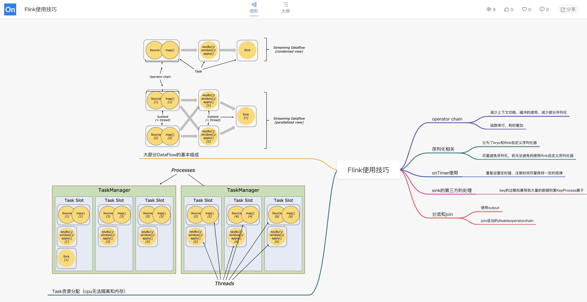

# Flink Meetup

#### 一、Flink Kafka upsert 语义讲解。张亢  
0. 略  

#### 二、Flink 指标监控。靳朔
0. 略  

#### 三、基于Flink搭建事件分析系统。董鹏飞
0. 元数据管理，定义事件结构  
1. 日志数据接受，根据元数据进行校验  
2. 采用flink实时对事实数据进行补维打宽、入湖入仓  
3. bi可视化平台定义指标、做数据分析  

#### 四、构建Flink作业管理平台。付越
0. 略  

#### 五、Flink CEP介绍。郝佳龙
0. 复杂事件处理，主要解决多事件按照一定规则发生问题，内部实现非确定有限状态机  
1. 动态更新规则不太方便，主要规则更新后任务重启比较慢

#### 六、Flink + Iceberg 构建数据湖。温泽方
0. 略  

#### 七、Hadoop3.0纠删码介绍。张金山
0. EC最显著的用途：廉价磁盘冗余阵列(RAID)  

#### 八、Flink + Drools 构建规则引擎。王春泉
0. 定义的规格可以存在mysql中，通过监听binlog捕获规则的变更  
1. 采用broadcast动态更新flink中的规则
2. 将一类规则放在一个规则租中，实时数据流通过时，对整个规则组中的规则都要进行检验  
3. drools中也有状态的概念，flink的状态是可以持久化的，drools中的状态可能会丢

#### 九、基于Flink SQL架构讲解。康琪
0. flink sql采用calsite做sql解析，calsite相当于一个没有存储层的数据库  
1. calsite(数据库系统)的基础理论是关系代数(relational algebraic)  

#### 十、垃圾回收算法介绍。张亢
0. 标记清除算法  
1. 复制算法  
2. 标记压缩算法
3. 分代回收算法

#### 十一、Flink Runtime案例分析。靳朔
0. 运行时架构图
   
1. Flink 网络参数里的buffer，一个buffer实际上还是一个MemorySegment，不管是Spark、Flink还是其他做了主动内存管理的框架，本质上都是在堆外模拟操作系统的分页内存管理，MemorySegment就相当于一个Page。
2. 对象构成及overhead解释：一个对象有header（对象头）、payment（对象数据）、footer（对象尾）、checkstyle（校验模块）等组成，其实只有payment真正存储数据，其他信息都属于overhead。
3. Flink POJO类在进行传输时，会序列化为MemorySegment进行传输，一个MemorySegment相当于一个分页内存，采用的是堆外内存。
4. 对CPU和内存消耗比较小的程序，比如操作外存多的。可以拆开Operator Chain进行运行，原理就是异步处理，这样能够提高并行度，如果采用async sink进行输出。
5. Flink某些算子需要显示的注册序列化类型，比如Hypeloglog，需要自定义序列化器进行注册。FlatMap算子需要在后面采用return的方式显示的指定序列化类型，flink在进行类型推断的时候会用。其他算子可以自动进行类型推断，FlatMap由于返回的是Collecter<T>，这种范型在虚拟机编译时会进行类型擦除，比如List<String>和List<Integer>对JVM来说是同种类型。
6. Timer使用注意事项。Timer底层存储采用的是最小堆（获取最小值的时间复杂度为O1），如果同一时间注册太多，或者删除太多Timer，就会导致频繁操作最小堆（因为要排序）线程就会夯在onProcessingTime方法中。在实际场景，我们用来统计APP内各个商品的相关数据，压力还好。如果key规模过大引起Timer过期风暴的话，性能确实不行，只能加大并行度，让KeyGroup尽量分散到各个sub-task了。

#### 十二、Flink Window TVF带来的新窗口机制。康琪
0. TUMBLE(滚动窗口)、HOP(滑动窗口)、CUMULATE(滑动窗口&间隔触发)  
1. TVF对窗口聚合的优化，原来滑动窗口会产生很多窗口和Timer（每个窗口都需要定时去清除），导致性能下降。新的设计逻辑多这块采用slice替换对滑动窗口进行划分，避免产生特别多的窗口  
2. CUMULATE添加参数，控制窗口是否增量输出，减小对外设的访问，但是需要后续进行压测，因为这样增加了状态的访问压力。此操作没有改calcite的代码  
3. 提出Flink学习方向。内核(对flink算子进行优化和扩展)、平台(提供可视化的作业管理和提交平台)、应用(采用flink完成实时数仓，实时战报，以及与AI相结合搭建实时推荐应用等)

#### 十三、JDK调优。董鹏飞
0. linux ps、top 的使用
1. java jps、jstat、jstack、jmap的使用
2. 内存分析工具mat的介绍