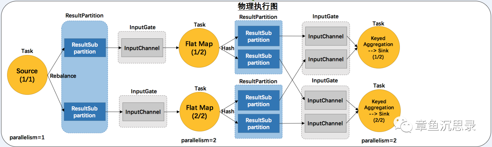

# Flink Back Pressure

  
可以看到每个task都会有自己对应的IG(inputgate)对接上游发送过来的数据和RS(resultPatation)对接往下游发送数据, 整个反压机制通过inputgate,resultPatation公用一个一定大小的memorySegmentPool来实现(Flink中memorySegment作为内存使用的抽象，类比bytebuffer), 公用一个pool当接收上游数据时Decoder，往下游发送数据时Encoder,都会向pool中请求内存memorySegment 。因为是公共pool，也就是说运行时，当接受的数据占用的内存多了，往下游发送的数据就少了，这样是个什么样的情况呢？

比如说你sink端堵塞了，背压了写不进去，那这个task的resultPatation无法发送数据了，也就无法释放memorySegment了，相应的用于接收数据的memorySegment就会越来越少，直到接收数据端拿不到memorySegment了，也就无法接收上游数据了，既然这个task无法接收数据了，自然引起这个task的上一个task数据发送端无法发送，那上一个task又反压了，所以这个反压从发生反压的地方，依次的往上游扩散直到source,这个就是flink的天然反压。

输入分区和输出分区的对应关系。物理执行计划如图：  
  
在数据输出方面，主要包含两个核心抽象：  
- ResultPartition：是一个Task的输出的抽象，包含若干ResultSubPartition。
- ResultSubPartition：下游请求数据是请求ResultSubPartition，而不是ResultPartition，负责实际上存储Buffer.

ResultPartition数量决定因素主要是上游并行度。

ResultSubPartition数量决定因素主要是：下游并行度 + 上游数据分发模式

另外，关于Buffer，在Flink中Java对象的有效信息被序列化，在内存中连续存储，保存在预分配的内存块上，内存块叫作MemorySegment，即内存分配的最小单元。很多运算可以直接操作序列化的二进制数据，而不需要反序列化。MemorySegment可以在堆上：Java byte数组；也可以在堆外：ByteBuffer。Task算子处理完数据后，将结果交给下游的时候，使用的抽象或者说内存对象是Buffer。其实现类是NetworkBuffer。一个NetworkBuffer包装了一个MemorySegment。

在数据输入方面，主要包含两个核心抽象：  

- InputGate：是一个Task的输入数据的抽象，包含若干InputChannel，主要包含SignleInputGate和UnionInputGate两个实现类

- InputChannel：实际负责数据消费的是InputChannel，主要包含LocalInputChannel，即数据本地性；RmoteInputChannel，即跨网络数据交换Flink选择了Netty

一个InputChannel对应上游一个ResultSubPartition。